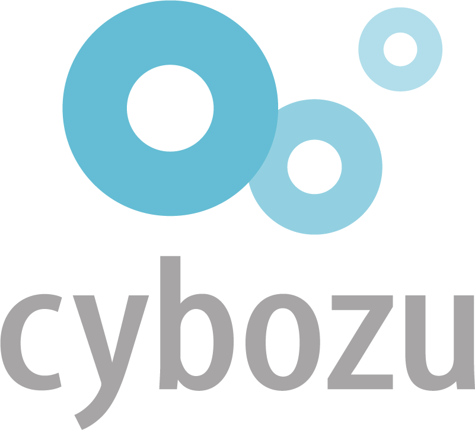

サイボウズインターンシップ 2022 に参加しました．9 つあるコースのうち，僕は生産性向上コースというところに行きました．生産性がチョモランマ！

## 3 行で概要をまとめる

- 期間は短い（5 営業日）がほとんど就業型インターン
- メンターさんと一緒にモブプログラミングできる
- ガチ障害に対応できるチャンスがある

## 忙しい人向けスライド

<iframe src="https://drive.google.com/file/d/1tQ0NQyfI7ptYZdebPoKCrk9TTIOhQTEg/preview" width="640" height="480" allow="autoplay"></iframe>

<!-- truncate -->

## 対象読者

この記事は主に以下の読者を想定しています．

- サイボウズインターンシップの参加を検討している人
  - 特に生産性向上コースの参加を検討している人
- サイボウズインターンシップ 2022 の詳細を面白おかしく読みたい人
- 将来の自分

### 他のインターン生の参加記

TODO: 他のコースの参加を検討している人に向けて，それらのコースに参加した人の参加記を見つけ次第リンクを貼っていきます．

- 生産性向上
  - [僕と一緒に参加していたインターン生の記事](https://blog.sasakiy84.net/articles/cybozu-intern-2022)
    - 僕の記事ではインターンの内容を面白おかしく書いてるので，詳細はこちらの記事に丸投げしてます

## サイボウズとは

サイボウズさんは，「チームワークあふれる社会を創る」というパーパスの下，チームワークを促進・支援するグループウェア・メソッド事業を展開しています．将来の製品やサービスの基盤を作るための研究開発も行っています．サイボウズさんが提供されているグループウェアは kintone・サイボウズ Office・Garoon・メールワイズの主に 4 つであり，それぞれの役割が異なるために多様なチームを幅広く支援できます．

### 生産性向上チームとは

生産性向上チームとは，「サイボウズのエンジニアがつらいと思っている部分を最高にしていく」チームです．具体的には，エンジニアの生産性を上げる開発基盤を構築したり，自動・効率化の手法を取り入れたい他チームに導入支援を行ったり，生産性向上のための技術を探求したりするチームです．開発基盤の構築・運用の実例としては，AWS マルチアカウント管理の仕組み（後述しません）や自動でランナーの数がスケールする GitHub Actions セルフホストランナー（後述します）などがあります．使用技術としては，プログラミング言語だと Go や TypeScript，CI として GitHub Actions や CircleCI，他にも AWS や Terraform などと幅広いです．詳細は[こちら](https://note.com/cybozu_dev/n/n1c1b44bf72f6)を見ていただけると嬉しいです．

### サイボウズの主な有名人

- [sat](https://twitter.com/satoru_takeuchi) さん
  - [Rook](https://github.com/rook/rook)という OSS のメンテナをされてたりなど
- [宮田](https://twitter.com/miyajan)さん
  - [GitHub Stars の一人](https://stars.github.com/profiles/miyajan/)だったりなど

### サイボウズの主な激レアさん

- [田代](https://twitter.com/tasshi820)さん
  - [1 億円拾った方](https://twitter.com/geki_rare/status/1465282171501891585?s=20&t=umAFd6PF5o26OOvED_4u-Q)

### More Information

- [公式サイト](https://cybozu.co.jp/)
- [採用情報](https://cybozu.co.jp/recruit/)

## インターン諸情報

[ここ](https://cybozu.co.jp/company/job/recruitment/intern/improvement.html)をみてもらうのが確実ですが，こちらにも少し載せておきます（ただし，このページはリンク切れが予定されているみたいなので，リンク切れしている場合は「2022 年のサマーインターンはこんな感じだったらしいぞ」と話半分に見ていただけると嬉しいです）．

### 基本情報

- インターンの期間
  - 第一ターム：2022 年 8 月 29 日から 9 月 2 日までの 5 営業日
  - 第二ターム：2022 年 9 月 12 日から 9 月 16 日までの 5 営業日
- 開催場所
  - オンライン
- 待遇
  - 時給 2,500 円
  - レンタル PC（MacBook Pro）の貸与
  - 懇談会などの食事手当
  - ノベルティの贈与
- インターン生の数
  - 各ターム 2 名

### 選考

インターンの選考は以下の流れで行われました．

1. エントリー
2. エントリーシート選考
3. 面接 1 回

### プログラム概要

インターン中は実際に存在するタスクをモブプログラミングの形式で解決していきます．モブプログラミングはメンターさんを含め 3〜5 人で行います．また，取り組むタスクはインターン生で決めることができ，今回はセルフホストランナーという仕組みに関するタスクに取り組みました．

ここで，[セルフホストランナー](https://docs.github.com/en/actions/hosting-your-own-runners/about-self-hosted-runners)とは，自前で用意する GitHub Actions のランナーのことです．逆に GitHub が用意してくれるいつものランナーは GitHub ホストランナーと呼ばれています．セルフホストランナーは，社内ネットワークにアクセスできる環境にランナーを構築したり，ランナーの性能（ハードウェア，OS など）をカスタマイズしたりするなど，GitHub ホストランナーと比べてランナー構成の自由度が増します．セルフホストランナーを自前で用意する方法ですが，生産性向上チームではメンターさんも貢献されている[こちらの OSS](https://github.com/philips-labs/terraform-aws-github-runner) を活用し，以下の画像で示すシステムによってランナーを用意しています．この OSS にはランナーの数を自動スケールする仕組みが備わっているのですが，そのランナーをためておく場所を生産性向上チームではセルフホストランナープールと呼んでいます．なお，この OSS は Terraform 製です（AWS Lambda 関数は TypeScript で書かれてる）．

さて，今回取り組んだ具体的なタスクは，大まかに次の 2 つになります．

1. セルフホストランナープールの AWS アカウントに予算アラートを設定する
2. セルフホストランナーを使わないジョブでもセルフホストランナーが起動してしまうトラブルの改善

1 つ目のタスクは予算アラート（AWS Budgets）を Terraform で設定するだけの易しめなタスクです．僕ともう一人のインターン生は Terraform の初心者だったので，Terraform の入門として取り組むためのタスクでした．2 つ目のタスクは 1 つ目のタスクと比較してかなりキツめのタスクです．このタスクの背景としては，当時はセルフホストランナーを使わないジョブ（e.g. 社内ネットワークにアクセスしないジョブ）でもセルフホストランナーが起動しており，無駄なコストがかかっていたことがあります．このタスクを達成するためには 4 つのサブタスクを達成する必要があるのですが，詳細は後述します．

タスクに取り組む以外にも，1 日の始まりと終わりにそれぞれ朝会と振り返りとしての KPT をやったり，社内の勉強会などのイベントに参加したりします．社長の青野さんに直接質問できたりもします．最終日には複数のコースの人たちが一同に集まって成果発表会を行います．

ちなみに，インターン中に使うツール系は次の通りです．

- エディタ
  - 自由（IntelliJ IDEA のライセンスが与えられますが，僕は VSCode を使ってました）
- チャット・TODO アプリなど
  - kintone
- チャット（私用 PC からの連絡時など）
  - Slack
- スケジュール管理
  - Garoon
- 通話
  - Zoom
- チケット管理
  - [Linear](https://linear.app/)
- 作業記録
  - [Confluence](https://www.atlassian.com/software/confluence)

## 参加動機

生産性の向上に強い興味があるからです．僕はコンピュータがすべき作業を人間がすべきでないと考えているため，定型的な作業は日々自動化しています．例えば，プログラムを手動でアセンブルしていた状況を解消するためにアセンブラを開発する，などです．他にも，作業の効率化につながりそうなツールを積極的に導入したり，自動化できない作業であっても最小のステップで作業を完了できるようにしています．このような生産性を向上する取り組みの中で，ある作業をどれだけ効率化できるかは自分の手札に大きく左右されることに気づきました．すなわち，課題の解決に繋がる知識の量によって，ある作業の効率化により下げられるコストが大きく異なると考えています．そのため，今回のインターンを通して現場で使われている最新の技術を知り，自分の手札を増やしたいです．また，モブプログラミングでチーム開発が行われるため，メンターの方が行われている個人的な生産性向上の取り組みや，チーム内の生産性向上に関わる暗黙知を習得できるチャンスでもあると考えています．

……みたいなことをエントリーシートに書きました．ここで，コンピュータがすべき作業というのは，プログラムで解決しやすい定型的な作業（単語の置換や全文検索など）を指しています．まぁこれでもまだ曖昧なんですが，言いたいことは「退屈なことはコンピュータにやらせよう」くらいのニュアンスです．退屈なことはできるだけやらずに面白いことだけやってたいし，人がやると間違えるから間違いのない方法でやりたい，って気持ちが根底にあります．ちなみに，ここで言っているアセンブラは[これ](https://github.com/ajfAfg/mips_assembler)．

## インターンシップ本舗！

インターンの詳細を見ていきます．

### 顔合わせ

インターンの初日にランチ会も兼ねたメンターさんとの顔合わせがありました．メンターさんとお話しする初めての機会だったので結構緊張していたのですが，なんというか，**話のノリが Twitter** で一瞬で馴染めました．初っ端から[育成シミュレーションゲーム](https://idolmaster-official.jp/)の話が出ることある！？　めちゃくちゃ面白かったです．パーフェクトコミュニケーション！

### タスクの詳細

今回取り組んだタスクは，サブタスクまで含めると次の通りです．

<!-- 1. [x] セルフホストランナープールの AWS アカウントに予算アラートを設定する
2. [ ] セルフホストランナーを使わないジョブでもセルフホストランナーが起動してしまうトラブルの改善
   1. [x] staging/production で異なるバージョンの AWS プロバイダを利用できるようにする
   2. [x] AWS プロバイダのバージョンを上げる
   2. [ ] GitHub ホストランナーを使うジョブでランナーが立ち上がらないようにする
   3. [ ] プールのランナー全体の同時起動上限のアラートの閾値を上げる -->

- [x] 1. セルフホストランナープールの AWS アカウントに予算アラートを設定する
- [ ] 2. セルフホストランナーを使わないジョブでもセルフホストランナーが起動してしまうトラブルの改善
  - [x] 1. staging/production で異なるバージョンの AWS プロバイダを利用できるようにする
  - [x] 2. AWS プロバイダのバージョンを上げる
  - [ ] 3. GitHub ホストランナーを使うジョブでランナーが立ち上がらないようにする
  - [ ] 4. プールのランナー全体の同時起動上限のアラートの閾値を上げる

チェックが入った 3 つのタスクを完了できました．2 のタスク全部終わらせたかった……

なお，[プロバイダ](https://www.terraform.io/language/providers)とは AWS や GCP などの API を抽象化する機構のことで，AWS プロバイダとはその 1 種です．

---

NOTE: 現在，順序付きリストをネストできない不具合が生じているため，順序付きリストのネストを順序なしリストで表現しています．HTML のセマンティクス的に不適切だし冗長でもあるのですが，正しい順序付きリストと錯覚していただけると助かります．

---

タスク 2.1 の背景は，当時は staging/production 環境がどちらも同じ AWS プロバイダに依存しており，片方の環境だけで AWS プロバイダのバージョンを変更できなかった，というものになります．タスク 2.1 以降の作業をぶっつけ本番で進めて production 環境をブッ壊してしまうとマズいので，作業内容をまず staging 環境で検証するために必要なタスクです．タスク 2.2 の背景は，タスク 2.2 以降の作業を進めるために使用している OSS のバージョンを上げる必要があり，付随して AWS プロバイダのバージョンも上げる必要がある，といったものです．

### 孫 Terraform 少年編

タスク 1 は易しめの内容だったので，ギャグテイスト強めなドラゴンボール初期を感じさせる雰囲気で進んでいきました．タスクの内容よりツールの使い方とかドメイン知識を把握することの方が大変だった気がします．当時発生していた別の問題の影響で CI が落ちるなどのトラブルはありましたが，全体的にスムーズに進んで 2,3 時間ほどでタスクを達成できました．

### Terraform 大魔王・サイヤ Terraform 編

タスク 2 はタスク 1 の頃と打って変わって殺伐としてきました．まずタスク 2.1 ですが，既に某大魔王を彷彿させる難しさがあります．当時は staging/production 環境が同一ファイルに定義されていたので，異なるバージョンの AWS プロバイダを利用するためには，それらの環境のコードを別々のファイルに切り出す必要がありました．これは一般的なプログラミング言語ならなんともない作業だと思うのですが，Terraform でコードを切り出すときは State という Terraform の内部状態も一緒に切り出す必要があります（[`terraform state mv`](https://www.terraform.io/cli/commands/state/mv) というコマンドを叩いて移動させます）．ここで，State とは実際に動いているリソース（Amazon EC2 のインスタンスなど）を管理する情報のことです．Terraform は切り出す前と後のコードから作られるリソースが同一であるとコードだけでは判断できないため，コードと State の切り出しを合わせて行わないと実際に動いているリソースが作り直されがちです．リソースが作り直されるということはシステムが停止する時間があるということなので，できるだけ避けたいです．しかし，この State という概念の理解がそもそも難しかったり，State の切り出しの作業も少し面倒だったりと，なかなか歯応えのあるタスクでした．

タスク 2.2 はきたねぇ花火を打ち上げてきます．AWS プロバイダのバージョンは，具体的には 3 系から 4 系へのメジャーアップデートを行います．同時に OSS のバージョンも 0 系から 1 系へメジャーアップデートします．本来はこれらのバージョンアップを別々に行った方がよいのですが，使用している OSS の都合で同時にバージョンアップする必要がありました．メジャーアップデートなので破壊的な変更が例にも漏れず入っており，この影響でバージョンアップ前と後の State に 3,000 行の差分が出てしまいました．このままではリソースが大量に作り直されるのでなんとかしなきゃなんですが，幸いにも今回作り直されるリソースは一度停止しても問題のないものでした．なので，タスク 2.1 のときと違って作り直しという手段を取れました．助かる．流石に 3,000 行の調査を全て手動でなんかやってられないので，調査にはシェル芸が大活躍でした．やったか！？

#### ガチ障害の発生

やってませんでした．しかもガチ障害として悪魔復活しました．障害の内容は staging 環境における EC2 インスタンスの増加が止まらないというものでした（下の図を参考）．本来は 30 台/organization のインスタンス数の上限があるのにも関わらず，120 台/organization ほどの m5.large が作られていました．端的にいうとクラウド破産の危機です．

この障害のヤバイところは，production 環境に staging 環境と同様の変更を加えた後に発見されたことです．時間差攻撃！　 同様の現象が production 環境でも起こるとマジで洒落にならないです．にも関わらず，この障害のヤバイところ 2 として，障害前にロールバックできない，というのがありました．原因としては，4 系の AWS プロバイダによるリソースが State に存在していたため，その State を 3 系の AWS プロバイダが受け付けられないことでした．State をイジってうまくバージョンを合わせる手もなくはないですが，そのためにはまた 3,000 行の差分を相手にする必要があり筋悪な気がします．障害がガチすぎてメンターさんも結構焦ってた記憶があります．

#### 障害対応

障害の原因は Terraform の AWS プロバイダのバグでした [^1]．このバグの影響で EC2 のインスタンス数を増やす Lambda 関数が更新されておらず，インスタンス数の上限が働いていませんでした．特定の手順を行った場合に起こる系のバグだったので，なかなか原因の特定が困難でした（僕はなんも貢献できんかった 🫠）．障害の対応としては，更新されていない Lambda 関数を手動で無理やり最新にする，というのをやりました．

[^1]: [aws_lambda_function does not use partial state and will update the "filename" property even when it can't be read. #25886](https://github.com/hashicorp/terraform-provider-aws/issues/25886)

### 仕上がってるよ！仕上がってるよ！

チーム内で[ソフトウェアエンジニアのかけ声](https://note.com/k2wanko/n/n4a4accd2f77c)というのが流行ってました．きっかけは，KPT の時間に僕が 「（僕が）ナビゲータのときの（僕の）貢献度が低い」との Problem を出し，その Try としてこのかけ声を実践してみることがメンターさんから提案されたことでした．泣く子も黙る Try！

実際に実践してみると結構楽しかったです．これを実践しているモブプロ中はもうボディビル大会さながらで，それはもう凄まじい熱気に包まれていました（うそ）．チーム内のモブプロ中だけでなく，他のチームや人事の方が来る最後の成果発表会でもなぜかこのかけ声がチャットで飛び交ってて面白かったです．これから入るチームでは真っ先にこのかけ声をインストールしたいですね．進捗おばけ．

### 獺祭

ありがたいことに懇談会やランチ会などの食事手当を出していただけたので，全ての食事手当を最後の懇談会に全振りして獺祭を飲んだりしました．美味い酒は美味い．

<blockquote class="twitter-tweet">
会社の金で飲む獺祭は美味い <a href="https://t.co/KjHFxzsXFy">pic.twitter.com/KjHFxzsXFy</a>
&mdash; Show(暫定) (@ajfAfg) <a href="https://twitter.com/ajfAfg/status/1570693929372389378?ref_src=twsrc%5Etfw">September 16, 2022</a></blockquote> 

## 感想

感想です．

### 良かったこと

Terraform の深淵を覗けたことが最も良い経験になったと思います．Terraform を素振りするレベルだと，インフラの構成を変更したい場合は一度全部ブッ壊して作り直すことが平気でできてしまいます．しかし，プロダクト運用する場合はそうもいかず，Terraform の State をうまく付き合っていく必要があります．この辺りは個人でやっていて，かつプロダクトのユーザの数が少ないと作り直しという選択肢を取りがちなので，この機会に本腰を入れて取り組めてよかったです．関連して，実際に運用しているプロダクトコードに触れられたのもとても良かったです．技術的に面白いことに加えて，やっぱり趣味で書くコードと比較して責任が段違いに重たいです．大袈裟に言うと，自分が加えた変更でシステムが停止すると社内の生産性を下げ，最終的にはエンドユーザの生産性をも下げてしまう可能性があります．めちゃくちゃ重たい．プルリクエストを main にマージするボタンを押すときは，もう爆破スイッチを押すような気分になってました．この気持ちでコードを書くのは少し大変さもありますが，とはいえ仕事としてコードを書いていく上で結構大事だとも思っています．適度な緊張感があると丁寧な仕事ができそうなので．しかし，この気持ちは仕事を続けていくと薄れていく予感もまたしているので，定期的にこの記事を読み返すなりして忘れないようにしたいです．

他にも，メンターさんの技術力の高さを実感できたことが良い刺激になりました．ずっとモブプログラミングの形式で作業を進めていたので，ゼロ距離でメンターさんの技術力の高さを感じられました．こういう技術力の高さって資格みたいなわかりやすい称号と違って滲み出るものだと思うので，具体的にどういうところに技術力の高さを感じたのか答えるのは難しいのですが，本当にすごかったです．負けてられねぇぜ……！　技術力の高さを感じる他にも，実際の現場にジョインすることで効率の良いチーム開発の方法が学べました．具体的には，タスクの分け方や，作業の過程をしっかり残していくこと，議論の進め方などです．特に障害時の対応の仕方は勉強になりまくりでした．原因が全くわからない時は同期的に議論して，目星がついてきたら非同期に調べるってやり方が同期・非同期の利点をうまく活用してて参考になったのもあるし，最悪の場合を想定して動かれていたのが単純にカッコよかったです．最適なチーム開発の方法はもちろんチームによって変わってくると思いますが，うまく回っているチーム開発の例を肌で感じられたのはかなりよかったです．

めちゃくちゃしょうもないんですが，[僕が作っている Web アプリ](https://www.emojion.app/)をたくさん使ってくれて嬉しかったです．この Web アプリでは大喜利画像を簡単に作れるのですが，毎日大喜利画像をチャットに投稿してくれるメンターさんがいたり，他にも何かと使っていただいててにんまりしてました．開発者冥利につきますね．自分の作ったものを使ってもらってる姿を見られて開発のモチベがまた上がってきてるので，今後も継続的な開発を頑張っていきたいです．

生産性向上チームがめちゃくちゃお笑い的な意味で面白かったことも，インターンに楽しく取り組めた要因でした．実はインターンの参加前はサイボウズさんってお堅い感じなのかななんて思ってたりしたのですが，実際に中に入ってみると全くそんなことはなくめちゃくちゃ面白かったです．殺伐としがちな障害対応時ですらジョークが飛び交うくらいにはジョークが飛び交っていました．今年（2022）参加したインターン先の企業さんがどこもお笑い要素が強く，そろそろ就活の軸としてお笑いが欠かせない体になってきました．体にお笑いが宿ってる！

メンターさんの人数が 7 人でインターン生が僕を含めて 2 人だったので，濃密なコミュニケーションを取りやすかったところも楽しかったです．モブプロの合間に休憩を取ったり，ランチを 5 日間とも一緒に食べていただけたりと，業務とは関係のないゆるい会話もやりやすかったです．僕は会話があまり得意な方ではないのですが，誰かの好きなものに関する話を聞くのが結構好きで，ランチ中の会話はそういうものが多かったのも楽しかった要因でした．もちろん，お笑い要素が最後までたっぷりなのもあります．また，インターン生が 2 人だったため，お互いのことを根掘り葉掘り聞き合えたのもよかったです．もう一人のインターン生は IT 系の経験年数が短いにも関わらず既につよつよで，これからさらに強くなることを考えるともう凄すぎました．負けてられねぇぜ……！(2)　お互いの名字が佐々木ということで勝手に親近感を抱いているので，今後も「ササ＆ササ」として仲良くしていただけると嬉しいです．

長くなりました！　最後に書きたいよかったことはなんと言っても[ソフトウェアエンジニアのかけ声](https://note.com/k2wanko/n/n4a4accd2f77c)を習得できたことです！　これを習得できたことがインターンに参加して一番よかったことと言うのは過言ですが，汎用性の高さがエグいのでしばらくハマりそうです．かけ声マスターが歩いてる！　いつか[原著](http://www.small-light.com/books/book059.html)にもあたってみたいですね．

### 反省点

もっと視野を広げてチームへの貢献の方法を探したいなと思いました．貢献の方法として，コードを書いたりアイデアを出したりするあたりがわかりやすいですが，これらはそのとき使用している技術やドメインを深く理解していないと難しいです．今回使用した Terraform はかなりの初心者だったので，特にナビゲータの時に貢献できることがないと焦っていました．しかし，貢献の方法として先述したかけ声をメンターさんに提案していただいたり，もう一人のインターン生が作業ログを残すという方法で貢献していたりして，チームに貢献する方法はいろいろあるんだなーと痛感しました．僕は視野が狭くなりがちなところがあるので，他に取れる手段はないか意識的に考えたり，他の人の意見をもらったりして対処したいです．

また，ある結論が導出されるまでの過程をもっと意識していきたいです．例えば，`git push --force` というコマンドはしばしば悪者扱いされますが，これが悪さするのは複数人が同一のブランチ上で非同期に作業する場合に限るはずです．なので，複数人で作業している場合であっても，例えばモブプログラミングの形式で複数人が同一のブランチ上で**同期的**に作業する場合は `git push --force` を使って問題ないです．むしろコミットメッセージを整理できて便利です．このような出来事がインターン中に何度かあって，僕は結論ばかり見すぎてたなーと個人的に結構反省してました．前提条件が異なる場合に同じ結論は適用できないので，他の誰かが出した結論にフリーライドせずに考え続けたいです．

上にかけ声を習得したと書きましたが，インターン中に練度を高めきれなかったことも反省点です(?)．まだ羞恥心を捨てきれてないですね，根っこがシャイなので．声に出すって結構コストがかかる行為なので，ボタンを押してかけ声を出すアプリとか作ると面白いかも，知らんけど．

## まとめ

めちゃくちゃ楽しい 5 日間でした！　ずっと笑いっぱなしだったし，技術的に難しい課題にも取り組めて大満足です．ナイスインターン！　タスクを全て達成できなかったことは心残りですが，続きは入社してからって感じですね．

インターン中の印象に残っていることとして，メンターさんが休憩の時間に他チームで起きている問題の解決に協力していたことがあります．チームで起きている問題ってそのチーム内で閉じがちだと思っているので，チームを超えて問題の解決に取り組まれている姿を見て素晴らしいなと感じました．今回の観測範囲は生産性向上チームが主でしたが，このようなやりとりを見たりしていると，お互いに助け合う文化はサイボウズさん全体に根付いているんだろうなと思います．こういった組織に今回ジョインできて，なんだか嬉しいというか誇らしかったです．

生産性がチョモランマ！　今後もかけ声を普及させていく傍ら，生産性向上にも努めていきたいと思います．5 日間本当にありがとうございました！
