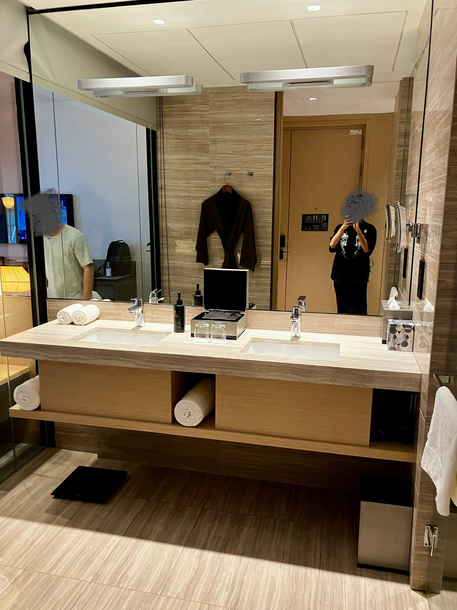
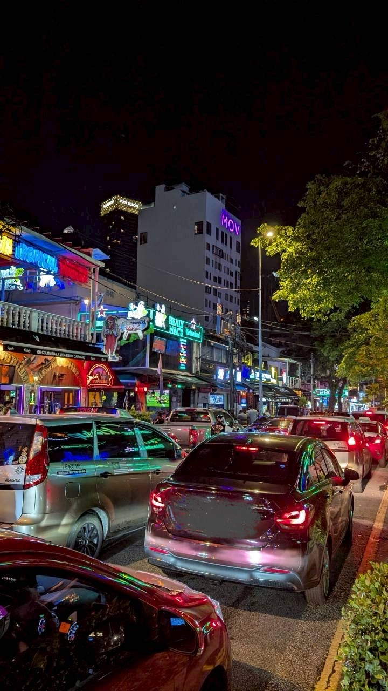

というタイトルのマレーシア旅行の感想です。初海外旅行だったので記念に。

タイトルに関係する話は「[マレーシアでのダンスミュージック](#マレーシアでのダンスミュージック)」にあり、その他は雑多な感想です。

<!-- truncate -->

## なぜマレーシア？

同行者の一人がマレーシアに行きたい！と言ったので、僕ともう一人がお供するぜ！となってマレーシア旅行が爆誕しました。ノリで生きてる。

マレーシアは物価が安い（2025/10/20 現在）ので、五つ星ホテルも一人 1 万ちょっとで泊まれてしまいます。東京でビジネスホテル泊まったら同じくらいの値段になるので破格ですね。というわけで、今回は 3 つの五つ星ホテルに代わる代わる泊まり、あとは流れで観光する形の旅行になりました。

## すごくてすごい五つ星ホテル

なんかすごかったです。平静を保つために意味なくサングラスをかけたりしてました。

今回泊まったのは以下のホテルです。例えば東京のヒルトンに泊まろうとすると早割でも 3 万は越えるっぽいです。ひえ〜。

- [ヒルトン・クアラルンプール](https://www.hilton.com/ja/hotels/kulhihi-hilton-kuala-lumpur/)
- [EQ クアラルンプール](https://eqhotel.com-kualalumpur.com/ja/)
- [マンダリン オリエンタル クアラルンプール](https://www.mandarinoriental.com/ja/kuala-lumpur/petronas-towers)

五つ星ホテルでまず驚いたのは、チェックイン中にウェルカムドリンクが出てくるところです。チェックイン作業する人以外は暇なので、その暇を楽しむ仕組みとしてよくできてるな〜と思いました。どのドリンクも少し甘いフレッシュな味わいで、旅の疲れを癒せて最高でした。あまりに嬉しくて秒で飲んだので写真は撮り忘れた。

全ての衝撃を吸収するふかふかな廊下を歩いて辿り着いた部屋はドチャクソ広くて綺麗でした。装飾とか照明とか香り全てに品がある〜。サニタリーは広いし綺麗だしで、洗面台と浴室が一体になった我が家を思い出して感動で涙が出そうになりました。浴室の扉は全部スケスケで草。高級なホテルってそうなん！？　でっかい窓の外からはビルが群生するクアラルンプールやホテル備え付きのプールが見えたりもしました。

そうなんです。任意の五つ星ホテルにはプールが備え付けられているんです（語弊）。せっかくなのでナイトプールに初挑戦してみました。でっかい浮き輪でプカプカしながらトロピカルジュースを嗜めるんだろうなと期待を込めて突撃！してみるとそんなものはなく、人も少なくて閑散としていたので、ガチクロールしたりしてました。それはそれで楽しかった。脇にあった大型チェスで同行者にボコボコにされたのも良い思い出です。

ホテルのご飯やお酒もしっかり美味しかったです。お通しで sushi が出てきた時は流石に笑った。

あと、今回泊まったホテルはガッツリ洋式だったので、馴染みのある文化ってところが休息にめちゃくちゃ良かったです。海外旅行に慣れたらローカルのホテルに挑戦するのも良さそうではある。

## 実家のような安心感

マレーシア、少なくともクアラルンプールには日本企業が多数進出していて実家のような安心感でした。セブンイレブンやドンキをはじめとして、まねきねこまでありました。カラオケ文化の海外進出すごいな。和食を扱うお店もそれなりにあって日本食の人気の高さが伺えました。sushi 専門店のメニューを覗いてみると真正面から攻めててトンデモ商品はなく、これには日本人の僕もニッコリ。

## とにかく美味しいご飯

どれも美味しかったです。辛めな料理が多いんですが、僕は割と辛党なのでドンピシャでした。幸せをお裾分けします。

最後の 2 枚は Nasi Lemak（ナシレマッ）という料理で、僕はこれが特に好きでした。好きすぎて帰りの飛行機に乗る直前に急いで食べ直してました。ご飯はココナッツミルクで炊いてるので甘めで、他の辛いおかずととても合います。チキンは皮がとんでもなくパリッとしていてホンマに美味いです、ホンマに。マジで革命だった。毎日食べたい。

チャイナタウンではドリアンも食べてみました。ドリアンといえば臭いことで有名ですが、実際に対峙するとそんなことなかったです。確かに独特な匂いはするんですが、ドリアンだな〜って感じるくらいで、嫌な匂いではなかったです。ドリアンはビニール手袋して手で食べるんですが、手に臭いがつくこともなかったです。（同行者によると加工品はヤバいらしいです。）味もクリーミーでほんのり甘く、他の食材で喩えられない唯一無二な味でした。美味しかったよ。

## ヘナタトゥー入れてみた

マレーシアではヘナタトゥーという消えるタトゥーが人気らしかったので、せっかくだし入れてみました。色んな場所で入れられますが、僕はセントラル・マーケットという場所で入れました。メニュー表から好きなデザインを選ぶんですが、中性的で柔らかい雰囲気がいいなと思って選んだら 🖕 が映えるデザインになりました。言われて気付いた。

新しい服を着てるみたいで楽しかったです。

## マレーシア・クアラルンプールっぽさ

### 街

クアラルンプールはめちゃくちゃ都会でビルが群生してるんですが、東京とはまた違った様相でした。何が違うんだろうな〜と思いを馳せてみると、一番の違いはデザイン性に富んだ建築物が多数存在することなのかなと思いました。例えばこれ↓↓↓。未来的だし力強さも感じられてすごい。同行者によると、こういう建造物は日本だと地震の影響で建てづらいらしいです。確かに。高いビルが多いのも地震の影響があまりないからかも。

あと、よく目にした集合住宅にマレーシアっぽさを感じていました。写真はないんですが、遠くから見るとお城っぽくて良かったです。お城がたくさんあるって素敵じゃない？　モスクがいろんなところにあったのも良かったですね。ブルーモスクや国立モスクははちゃめちゃに綺麗だった。

### お釣り

ほとんどの場合、お釣りを出さないようピッタリの支払いを求められます。これがなかなか難しくて、マレーシアの通貨であるリンギットは紙幣だけでも 6 種類あるので、仲間内でなんとかやりくりしてました。最後の方はピッタリ揃えるのが面倒くさくて、お釣りはチップとして渡してたりしました。（チップとして渡されるのを期待してるからお釣りの計算を渋ってるのかもしれない。）キャッシュレスで払えるならそっちの方が楽です。

なお、モールや空港内のお店ではフツーにお釣りを出してくれました。場所によるのか……。（レジ付きでもお釣りを渋られる場合があったので、レジの有無は関係なさそう。）

### ッ

マレーシアでは英語が普及していますが、公用語はマレー語です。マレー語では単語の末尾に「ッ」が頻出するなという気づきです。先述した Nasi Lemak（ナシレマッ）もそうですし、「美味しい」を意味する Sedap（スダッ）や、地区名のブキッ・ビンタン（Bukit Bintang）などなど、探せば色々あります。頻出する背景まではわからないですが、マレーシアをちょっと深く知れた気がして嬉しいです。

## Communicating in English

僕は Listening と Speaking が絶望的（Reading と Writing ができるとは言ってない）なんですが、感情や感想を伝えるのは割とできて自信がつきました。嬉しいと伝えられるとこっちも嬉しい。マレーシアで初めて乗った Grab（アジア版 Uber）のドライバーがかなりコミュニケーションを取ってくれる気さくな方で、そこでスタートダッシュを切れたのが大きかった気がする。ありがとう Grab のおじさん。

ただ、想定外の状況での会話はやっぱりほぼ無理でした。聞き取れなかった部分や返ってくる内容を推測できないのがキツい。あるバーで頼んだウィスキーの在庫が無くて、代わりにこっちを頼みなよ的なジェスチャーをされて、よくわかんなかったので「Yes! Yes!」と通してたので多分ぼられてます。伸び代ですね。同行者の二人は英語が堪能なのでヤバすぎる状況では助けてもらってました。例えば、外国の方に突然絡まれて「日本円見せてよ」って言われたとき、多分僕一人だったら素直に財布出してそのまま盗まれてるんですが、同行者がいい感じに対応してくれて助かりました。マジでありがとう。

## マレーシアでのダンスミュージック

これが書きたくて感想を書いてるまであります。本稿の本題。

ホテルのバーを楽しんだ後にもっとお酒飲みたいねとなり、バーが集まってるらしい場所に向かうとクラブバーが大量発生してました。マジでたまたま見つけた。そこは道沿いにクラブバーが乱立していて、地上でガンガン音を垂れ流してました。21 時を超えても。最高か？？　なお、この通りはチャンカット ブキッ・ビンタン（Changkat Bukit Bintang）という場所です。

ひとまずマレーシアで流行ってる音楽が知りたかったので、それっぽい音が聞こえてきた店に入りました。そこでは Spotify で曲を流し、そこにコンガでリズムを乗せるスタイルで、早速これまでの常識がぶち破れました。Spotify？？？？？？？？？？？？？？　最近リリースされたミックス機能を使うでもなく？？？？？？？？？？　最初はビックリしましたが、ラテンのパーカッシブな音楽とコンガがめちゃくちゃ合うんですよね。何よりお客さんがめちゃ踊ってる。すげー良い空間でした。演者の方が演奏をやめてお客さんと話し込む場面も度々あって、めちゃくちゃ自由でゆるい感じも良かったです。

めっちゃラテンの風を感じたところで、次はゴツい電子音が聴きたくなってきたので EDM が鳴り響いてる店に入りました。そこはもうあの頃の EDM って感じで、「[Avichii - Wake Me Up](https://youtu.be/IcrbM1l_BoI?si=OFU_TzgPQgwbyeoz)」や「[Major Lazer - Lean On](https://youtu.be/YqeW9_5kURI?si=_sB5emkk7VYEUlMY)」などが流れていた記憶があります。この店では 2 人で B2B やってました。全然前まで行って踊った。世界的に人気のある曲はマレーシアでも例外なく人気なんだなと、この辺りから仲間意識みたいなものが育まれてきました。酔いが回り始めただけだったかもしれない。

次は店の奥でめちゃくちゃ盛り上がってる場所に入りました。ビールの注文が済んだくらいのタイミングで「[DJ Snake - Taki Taki](https://youtu.be/ixkoVwKQaJg?si=L0u_qkjrlafKzcWc)」が流れてきたので、ダッシュで店の奥に踊りに行ったら、陽気なお兄さんたちがステージに上げてくれて、一緒に肩を組んで踊ったりしました。ステージに上がるとき、ステージに足をぶつけてめっちゃ擦りむいたけど楽しかった。いつの間にか同行者の一人もステージの上にいて草だった。盛り上がってたら謎のお兄さんに店の外に連れられたんですが、お兄さんがスマホを触ってるタイミングで「[Zedd - Clarity](https://youtu.be/IxxstCcJlsc?si=-RRb9mewQuSIyImb)」が流れてきたのでダッシュで店の奥に踊りに行って、その謎のお兄さんとはそれっきりです。これが幸か不幸か、どちらだったのかは神のみぞ知る。

この日はこれで帰路に着いたんですが、同行者の一人がこの通りをえらく気に入って次の日も行きました。中の様子が外から丸見えなので怖くないとのことでした。わかる。クラブバー 2 日目は日曜日だったからか、1 日目と比較して Live Set なお店が多かったです。バンド編成で生演奏してる感じ。でも俺は DJ が聴きてぇよということで、軽くウィスキーを飲んだ後 DJ がいるお店に入りました。イエーガーマイスターで乾杯して気持ちよくなってたら Taki Taki がまた流れてダッシュ不可避。実は Taki Taki はセントラルマーケットの野外 DJ でも流れていたし、クラブバー 1 日目に歩いてるときも聞こえてきたしで、多分マレーシアで相当愛されています。その後なんか店員さんと仲良くなってハイタッチしたり写真を撮ってもらったりしました。Taki Taki が日本とマレーシアの架け橋。

<iframe width="560" height="315" src="https://www.youtube.com/embed/ixkoVwKQaJg?si=03rU2OHAoLXuseaa" title="YouTube video player" frameborder="0" allow="accelerometer; autoplay; clipboard-write; encrypted-media; gyroscope; picture-in-picture; web-share" referrerpolicy="strict-origin-when-cross-origin" allowfullscreen></iframe>

店員さんと別れて次はライブやってるお店でゆったりビール飲んでました。店員さんの営業がめちゃくちゃ上手くてありえん量のビールを飲ませようとしてきてたんですが、昨日もここ来たんだよ〜って言ったら照れくさそうに引き下がってくれたのが良かったです。パーフェクトコミュニケーション。

クラブバー通いの 2 日間で感じたことをまとめると、ラテンの風吹きまくりの一言に尽きます。ラテン音楽は詳しくないので少ししか触れてこなかったですが、ラテン音楽がルーツにありそうな曲がめちゃくちゃ多かったです。Taki Taki もリズムがラテンですよね。最近日本で流行りつつある気がする Baile Funk な曲もちらほらありました。ここで不思議なのが、なんで中南米から地理的に遠くて歴史的な交わりもそんなにない（と思われる）マレーシアでラテン音楽が流行ってるの？ってところなんですが、それは僕の英語力が足りなくて聞けませんでした。マジで悔しい。音楽・お酒で非言語コミュニケーションは取れるけど、もちろん言語コミュニケーションは取れないです。疑問のヒントを探すこともできない。英語勉強しなきゃなとなりました。でもまぁそういうとこを抜きにして、言葉があまりわからなくても同じ時間を一緒に楽しめる音楽とお酒はやっぱり素晴らしかったです。音楽とお酒がなかったら僕が外国の方と肩組んで踊ったりハイタッチとかありえないですからね。BIG LOVE。

## まとめ

水道や交通手段をはじめとするインフラが整っているし、ご飯の味も日本人の口に合うし、最高のクラブバー通りがあるマレーシアは、海外旅行初心者に優しい場所でした。ペナンとかピンクモスクとか、まだ行けてない場所はいっぱいあるのでまた行きたいです。See ya!

## おまけ: さかなー

