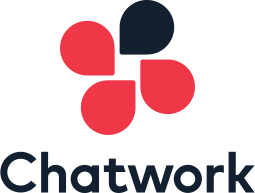
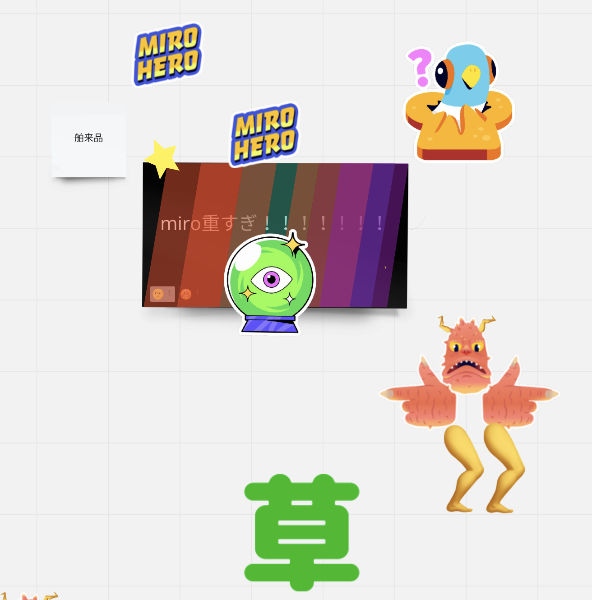
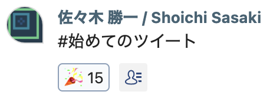

[Chatwork サマーインターンシップ 2022](https://recruit.chatwork.com/internship/2022/engineer.html) に参加しました．コースがフロントエンド（FE）とバックエンド（BE）に分かれていて，僕は FE の方に参加したのですが，それなのにこの個人ブログはまだテンプレートを使っててヤバいなーとなっています．FE の腕が光るところなのに！ 時間確保せんとね．

## 3 行で概要をまとめて

- 講義パートと開発パートで分かれている
- フロントエンドは TypeScript / React ，バックエンドは Scala / Akka HTTP で DDD をガッツリ学習・実践できる
- **関数型言語や型の話で盛り上がれる**

<!-- truncate -->

## 対象読者

この記事は主に以下の読者を想定しています．

- Chatwork サマーインターンシップの参加を検討している人
  - 特にフロントエンドコースの参加を検討している人
  - バックエンドコースの参加を検討している人は[こちら](https://qiita.com/diracmax/items/b838359f39c1a5d0de43)
- Chatwork サマーインターンシップ 2022 の詳細が気になる人
- 将来の自分

## Chatwork とは



Chatwork さんは，「働くをもっと楽しく、創造的に」というミッションの下，日本の 99.7%を占める中小企業の生産性を向上するビジネスを展開しています．現在の主力サービスは社名にもなっている Chatwork というビジネスチャットであり，国内利用者数 No.1 みたいです．今後はこのビジネスチャットを中心にさまざまなソリューションを提供し，ビジネスの基盤として「中小企業の生産性を向上する」といった大きな課題の解決を狙っています．

詳細は[こちら](https://go.chatwork.com/ja/)．

### Chatwork の主な有名人

- [かとじゅん](https://twitter.com/j5ik2o)さん
  - DDD の伝道師
- [だいくしー](https://twitter.com/daiksy)さん
  - スクラムの伝道師
- [高瀬](https://twitter.com/guvalif)さん
  - 関数型人事

3 人とも講義を受け持ってくれています．めちゃ豪華！

### More Information

- [公式サイト](https://go.chatwork.com/ja/)
- [採用情報](https://recruit.chatwork.com/)

## インターン諸情報

### 基本情報

[この世の全てではないが大体ここに置いてある](https://recruit.chatwork.com/internship/2022/engineer.html)．以下に記述している情報は，上記のサイトに置いてある情報に加えて，僕がインターン前に知りたかった情報となっています．

- インターンの期間
  - 2022 年 8 月 15 日から 9 月 2 日までの 15 営業日
- 開催場所
  - オンライン
- 待遇
  - 時給 1,500 円（講義パートは対象外）
    - オフラインで開催された場合は交通費や宿泊費が全額支給される予定でした
  - レンタル PC（MacBook Pro）の貸与
  - 懇談会などの食事手当
  - 参考図書の贈与
    - FE/BE 共通: [現場で役立つシステム設計の原則 〜変更を楽で安全にするオブジェクト指向の実践技法](https://gihyo.jp/book/2017/978-4-7741-9087-7)
    - FE のみ: [React ハンズオンラーニング 第 2 版](https://www.oreilly.co.jp/books/9784873119380/)
    - BE のみ: [実践 Scala 入門](https://gihyo.jp/book/2018/978-4-297-10141-1)
  - ノベルティの贈与
- インターン生の数
  - FE: 6 名
  - BE: 7 名

インターン生の他に，Chatwork の内定者（5 名）もインターンに参加されていました．

### 選考

インターンの参加権を得るために以下の 4 ステップの選考が行われます．

1. エントリー
2. エントリーシート選考
3. 面接 1〜2 回
4. コーディングテスト

なんですが，僕は[2022 年の 4 月ごろに参加したアイデアソン](https://chatwork.connpass.com/event/242000/)の縁でお誘いをいただき，エントリーと面接 1 回のみの選考でした．感謝……！！

ちなみに，選考の倍率は，社員さんに聞いた話だと 10 倍前後だったみたいです．

### プログラム概要

インターンは主に講義パートと開発パートの 2 つに分かれています．講義パートを初めの 5 営業日で行い，残りの 10 営業日で開発パートを行います．

#### 講義パート

講義パートはまた共通講義と専門講義に分かれており，共通講義では FE と BE が一緒に学び，専門講義では FE と BE がそれぞれの専門的な内容を学びます．以下のリストは講義のタイトルと概略です．なお，専門講義の方は FE のみを載せます．

##### 共通講義

- 会社を知る
  - 会社説明
- Web サービス開発の基礎
  - Web サービス開発の技術的な基礎（通信技術・インフラ・Web API など）を学ぶ
  - グループワークとして「我々が考える最良の Web サービスの開発(技術分野)構想」を考える
- バックエンドの開発環境構築
  - Scala の開発環境（OpenJDK / asdf / sbt）を整える
  - IDE として IntelliJ IDEA を使うことが推奨されていたが，好きなエディタを使うこともできる！
    - ~~Vim を使おう~~
- フロントエンドの開発環境構築
  - React の開発環境（Node.js / npm / Google Chrome）を整える
  - エディタとして VSCode の仕様が推奨されていたが，こちらも好きなエディタを使うことができる
- 要件定義
  - RDRA2.0 を基にした用件定義方法を学ぶ
- ドメイン駆動設計の戦略
  - DDD の抽象的な部分（モデリング手法）を学ぶ
- ドメイン駆動設計の戦術
  - DDD の具体的な部分（モデルの実装方法）を学ぶ
- 運用について
  - Chatwork さんの事例を交えながらシステム運用について学ぶ
- **アジャイル・スクラムの技法**
  - スクラムについて網羅的に学ぶ
  - スクラムを体験するワークショップを行う
    - これがめちゃくちゃ楽しかった（後述します）
- プロダクトマネジメントとは？
  - Chatwork さんの事例を交えながらプロダクトマネジメントについて学ぶ
- ベースプロジェクトの構成解説
  - 開発パートで開発するシステムのベースとなるプロジェクトを理解する
- インフラストラクチャー
  - ベースプロジェクトのインフラとデプロイ方法を理解する

##### 専門講義

専門講義は（少なくとも FE は全て）座学とハンズオンのセットで進みました．

- デザイン・エンジニアリング基礎論
  - 「デザイン」をめちゃくちゃ深掘りする
    - 具体的にはプロダクトデザインについて学ぶ
- 0 から作って学ぶ MV\* と SPA の原理
  - SPA の基礎を学び，MVC アーキテクチャの小さなチャットアプリを作る
  - MVC は標準の JavaScript ライブラリを用いて実現される
- **型システムによる制約と計算効果の取り扱い**
  - `State<S, A> ≒ <S, A>(_: S) => (_: A) => S`
  - 妙だな……🤔（ちゃんと後述します）
- React と宣言的 UI
  - React が生まれた背景や仕組み，基本的な使い方を学ぶ
- アプリケーションのレイヤー設計と Redux
  - アーキテクチャはどのように決められるのか学ぶ
  - Redux が生まれた背景や仕組み，基本的な使い方を学ぶ

#### 開発パート

開発パートではベースプロジェクトの追加機能をチームで開発します．ベースプロジェクトとは本家 Chatwork のミニマル版で，ログインやグループ単位のチャット（リアルタイムではない）といった，チャットツールに必要な最小限の機能を持つシステムです．チームは FE と BE のそれぞれ約 3 名から構成され，Chatwork さんからエルダーが 1 名ついてくれます．また，Chatwork さんの主に 5 名からレビューなどの厚い支援が受けられます．アツい．なお，開発手法はスクラムで，スプリントは 1 週間です．

追加機能は以下の 2 つから選択して開発します．片方を深くやりこんでもいいし，両方に挑戦してもいい，という感じでした．

1. タスク機能
   - [本家ではこんな感じ](https://go.chatwork.com/ja/column/usage/usage-007.html)
2. グループチャットのメンバーの権限（管理者・閲覧のみ，など）機能
   - [本家ではこんな感じ](https://help.chatwork.com/hc/ja/articles/203354320-%E3%82%B0%E3%83%AB%E3%83%BC%E3%83%97%E3%83%81%E3%83%A3%E3%83%83%E3%83%88%E3%81%AE%E3%83%A1%E3%83%B3%E3%83%90%E3%83%BC%E3%81%AE%E6%A8%A9%E9%99%90%E3%82%92%E5%A4%89%E6%9B%B4%E3%81%99%E3%82%8B)

開発時に使うツール系は，通話ツールとして Discord，オンラインホワイトボードとして Miro を使いました．チケット管理は GitHub の Issues で行いました．開発時に限りませんが，チャットツールとしてはもちろん Chatwork を使いました 😤

↓ これはウチのチームの Miro で爆誕した謎の図



他のチームには DDD（デデデ大王）がいたりしました．

## 参加動機

DDD を完全に理解したかったから．元々プログラムの設計に興味があり，GoF のデザインパターンを学習・実践していたり，テスト容易性を高めるために副作用を分離していたり，DDD も少し勉強して雰囲気で試したりしてました．なので，DDD を本格的に学習・実践ができる Chatwork サマーインターンシップに興味を持ちました．

FE と BE どちらのコースにするかはめちゃくちゃ悩みました．FE と BE，あとインフラ周りどれも楽しいから，今でもキャリアをどのロール（FE / BE / SRE）から始めるか悩んでいるくらいです．可能なら自分をもう一人スポーンして両方とも参加したかったです．

最終的にフロントエンドコースに参加することを決めたのは，FE の状態管理に関する課題を解決するアプローチとして DDD に取り組んでみたかったことが一番の理由になります．React や Vue.js といった FE のライブラリやフレームワークは状態管理が非常に複雑だと考えているのですが，これはどのような状態管理ライブラリを用いても完全には解決できないとも考えています．なぜなら，状態の仕様はアプリケーションに依存しているため，ライブラリは問題の解決につながる一定の枠組みまでしか設けられないからです．状態の仕様を決める箇所に設計が必要だと考えると，アプローチの一つとして DDD が浮かび上がります．フロントエンドコースはまさにその DDD を用いて状態管理に関する課題に立ち向かえる場所でした．当時の僕は Web 開発の文脈だと FE 寄りの技術を中心に触っていたためにこの課題の関心が強く，思い切ってフロントエンドコースに参加することを決意しました．

## インターンで何をやったのか週単位で見ていくコーナー

### 1 週目

1 週目は講義パートです．講義の内容は先述した通りで，どれもめちゃくちゃレベルが高いです．これが無料で受けられるなんて！　特に「デザイン・エンジニアリング基礎論」でプロダクトをユーザ（≠ 自分）目線で設計する大事さを痛感したり，「運用について」や「インフラストラクチャー」などで Chatwork さんの事例が聞けたことがめちゃくちゃよかったです．当初の目的であった DDD の講義では，質疑応答を交えながら DDD を学べて理解がめちゃくちゃ深まりました．

また，インターン初日に Twitter 感覚で使えるチャット（c.f. Slack の Times）が設けられ，そこに書いた講義中のメモや日報から雑談や議論に発展したりと一週目からわいわいできました．↓ こんな感じ．



#### 「アジャイル・スクラムの技法」

スクラムの講義中に行われたワークショップがめちゃくちゃ楽しかったので詳しく書きます．

##### ワークショップの内容

ワークショップではマルチプレイのちょっとしたゲームを行います．どういうゲームかというと，シールで装飾されたイケイケな付箋を 5 分間にできるだけ多く作ると高評価，というものです．ただし，「イケイケな付箋」は明確な定義があり，その定義を満たさない付箋は数にカウントされません．また，イケイケな付箋の作り方にも制約があり，ベルトコンベア方式（自分の担当作業以外の作業をやる，前の手順に戻る，などは NG）で作る必要があります．なお，ゲームのプレイ環境は Miro でした．

このワークショップの目的はスクラムを体験することだったので，ゲームの前後に見積もりと振り返りを行います．見積もりでは次のゲームでイケイケな付箋をどれくらい作れるか話し合い，振り返りでは前のゲームで良かったこと・悪かったことを分析して次のアクションを議論します．

##### 完成品 0

60 くらい作れるやろ！　と最初の見積もりでは考えていたのですが，結果は驚きの 0 でした．より正確にいうと，イケイケな付箋っぽいものは 5 つ作れたけれども，どれもイケイケな付箋の定義を満たせなくて数としてカウントされませんでした．振り返りで悪かったことを分析した結果，Miro の便利な使い方が周知できていないことや，次の人に流す付箋の数が多いと待ちが発生しやすい，といった問題点が浮かび上がってきました．そこで，Miro の使い方を周知したり，次の人に流す付箋の数を 1 つにしたり，といった解決策を試しました．

このような見積もり・ゲーム・振り返りのサイクルをに何度も回すとどんどん最適化され，最終的には見積もり 40 の結果 44 でした．めちゃくちゃ正確に見積もれてる！

##### 経験主義で考える

このワークショップを通して，スクラムの特に見積もりの部分を直感的に学べました．私たちは（というと主語がデカいので少なくとも僕は）対象を他の何かと比較して認識することが多いので，見積もりでも同様に今までの経験と比較して相対的に見積もると良いのはしっくりきます．ただ，経験を判断材料としている以上，その経験がない最初はどうにもならないとも思うので，その辺りをどうフォローしたらいいか今後考えていきたいです．

#### 「型システムによる制約と計算効果の取り扱い」

でたわね．

座学では TypeScript の型システムを深く学びます．深すぎて[依存型](https://ja.wikipedia.org/wiki/%E4%BE%9D%E5%AD%98%E5%9E%8B)とか登場します．あ，深淵と目が合っちゃった．先ほどチラ見した摩訶不思議な型 `State<S, A> ≒ <S, A>(_: S) => (_: A) => S` もありますからね（詳細はもう少し待ってくださいね）．全部載せです．

##### 構造的部分型で公称型をエミュレートする

依存型のような型オタクしか喜ばない話題だけではなくて，しっかり実用的な型の使い方にも触れられます．例えば，TypeScript のオブジェクトは[構造的部分型](https://typescriptbook.jp/reference/values-types-variables/structural-subtyping)であるため，同じ構造を持つ型は等しいものとして扱われます．しかし，その挙動が嬉しくない場面（c.f. 値オブジェクトの等価性 [^1]）があり，その対処法として以下の 2 つの方法が紹介されました．

[^1]: [実践ドメイン駆動設計](https://www.shoeisha.co.jp/book/detail/9784798131610)によると，2 つの値オブジェクト（のインスタンス）の型と全ての属性が等しいとき，それらの値オブジェクトは等しいと見做されます．この本では Java をプログラミング言語として用いており，Java のオブジェクトは公称型であるため，ここでいう型の等価性は公称型で扱われている前提があります．なので，TypeScript で値オブジェクトを作るときは，型が構造的部分型として扱われると都合が悪いので公称型をエミュレートする必要がある，と言えそうです．

1. 公称型のエミュレーション（タグづけ方式）

```typescript
interface Foo {
  _tag: "Foo";
  value: string;
}
interface Bar {
  _tag: "Bar";
  value: string;
}
```

2. 公称型のエミュレーション（ブレンディング方式）

```typescript
type Foo = string & { _tag: "Foo" };
type Bar = string & { _tag: "Bar" };
```

よっしゃー！　これでもうコンガとボンゴを間違えることはありません．ボンがコンガで，コンがボンゴですよ．

##### `<S, A>(_: S) => (_: A) => S`

待ってました！　君のことが気になって朝しか眠れなかったんです．

コイツは状態とその状態を変化させるアクションを受け取って新しい状態を返す，という型定義になっています．例えば，「空腹」という状態で「ご飯を食べる」というアクションを起こすと，「満腹」という状態にきっとなるでしょう．腹 8 分目とか言わないでね．

と，ここまでめちゃくちゃ説明を伸ばした割に，僕自身がこの型定義の基礎であるモナドをまだ完全に理解してなくてこれ以上の説明ができません．続きは実際に Chatwork サマーインターンシップに参加して君の目で確かめろ！

流石にこのまま説明を放り投げるだけでは不誠実なので，関数型人事の方に教えていただいたモナドに関する記事をここでも共有します．

- [絶対に理解出来ないモナドチュートリアル](https://konn-san.com/prog/never-understood-monad-tutorial.html)
- [箱で考える Functor、Applicative そして Monad](https://qiita.com/suin/items/0255f0637921dcdfe83b)

##### なんで俺…「TypeScript」を学んでいるハズなのに…「Haskell」を学んでいるんだよォォォ！！

この講義の担当が某関数型人事の方だったので，講義の各所に Haskell のエッセンスが詰められていた気がします．ピュアピュアやね（純粋関数型言語）．僕は関数型言語と型が大好物なのでめちゃくちゃ楽しかったです．

ちなみに，この講義のハンズオンは，一緒に講義を受けた同期によると [Type Challenge](https://github.com/type-challenges/type-challenges) と似ているみたいです．

めちゃくちゃどうでもいいことですが，この節のみ[すごい Haskell 本](https://shop.ohmsha.co.jp/shopdetail/000000001926/)リスペクトで書いてみました．

### 2 週目

2 週目は主に開発パートです（ベースプロジェクトやデプロイ方法の説明はある）．今回のスプリントは 1 週間なので，1 週間でインクリメントが出せるように頑張ります．僕らのチームはどちらの機能を作るかかなり割れたので，インターン期間中に両方とも開発するということで，初週は権限機能を開発することにしました．

#### ユーザ目線での議論

追加機能の仕様なのですが，What / Why / Who のみが定義されており，How は全てこちらに委ねられていました．How の部分も本家と全く同じものを作るなら特に議論をする必要はないのですが，ユーザが抱えている問題ってなんだっけ？　というところからしっかり考え，どのような How を行えば良いか議論しました（結果的に本家と少し異なる How になりました）．他のチームと比較しても，僕らはユーザ価値についてかなり深く議論できていたと自負しています（逆に How の技術的な部分に挑戦しきれなかったところはあるけど）．

要件定義やタスクの分割が終わった後は開発です！　開発は FE と BE で分かれてずっとモブプログラミングやってました．常に同期して開発するので，細かな疑問点を即座に解決できますし，常にレビューを行なっている状態なので一定のコード品質を保てます．ちなみにモブプロやるときは VSCode Live Share がめちゃ便利です．ドライバー交代のタイミングと git のコミットのタイミングを分けられるし，口頭で伝えづらいコードをさっとメモ書きできたりと最強です．

個人的に，UI / UX を FE だけでなく BE も巻き込んで議論できたことがめちゃくちゃ良かったです．講義「デザイン・エンジニアリング基礎論」で学ぶのですが，UI / UX はユーザ価値を届けるための礎なので，決してデザイナーや FE だけのものではありません．チームでユーザ価値について深く議論する経験ができて本当によかったですし，そういった議論ができるチームメンバーに恵まれて幸運でした．

#### Chatwork のコード品質

週終わりの金曜日に，ステークホルダー（の役割の社員さん）からレビューをいただきました．インターン的には成果発表会の立ち位置です．

先述の通り僕らはユーザ価値について深く議論していたため，その辺りの評価は高かったと思います．モデリングの筋も良かったみたいです．問題だったのが，開発したコードが Chatwork のコード品質になっているかという部分です．実は僕たちレビューを全く出していなかったんですね．先ほど「モブプログラミングは常にレビューを行っている状態なので一定のコード品質を保てる」と書きましたが，今回のモブプログラミングはインターン生のみで行っていたため，インターン生の間で合意が取れたコード品質にはなっているけれども Chatwork のコード品質になっているとは言えないです．僕はこの辺りを誤解していて，レビューに出さないというチームの意思決定を後押ししてしまっていたため，チームメンバーには本当に申し訳なかったです．

#### Chatwork CTO との 1on1

Chatwork の CTO の[春日さん](https://chado.chatwork.com/entry/2020/11/04/090000_2)に 1on1 で 1 時間ほどなんでも聞ける場が 2 週目の後半に設けられました．CTO の仕事や技術選定の方法，筋トレなど様々な話題でざっくばらんに話せました．大量に持っていった質問（15 個近く）全てを打ち返してもらい感謝です．他にも，Chatwork というサービスが今後どう発展していくのか少し伺えたりして楽しかったです．

### 余談

\> 「関数型言語や型の話で盛り上がれる」というのは講義のことだけじゃなかったんだ！！

\> な，なんだってーー！！

Haskell 使いの某関数型人事の方と OCaml 使いの Chatwork 社員の方をランチにお誘いして，関数型言語や型の話をしたりしました．お二人の関数型言語との馴れ初めや好きなところを深掘りしたり，突然 [Algebraic Effects](https://nymphium.github.io/2018/10/30/what-is-algebraic-effects.html) の LT が始まったりと意味不明で最高でした．~~この辺りの交流がインターンで一番楽しかったことかもしれない~~

関数型言語や型システムの基礎である圏論や型理論を勉強するモチベーションが再燃してしまったので，就活とか研究とかで色々と忙しいですが少しづつ勉強していきたいです．

### 3 週目

ラストの 3 週目は開発オンリーです．この週はタスク機能の実装に取り組みました．

#### ユーザの価値ってなんだっけ？

タスク機能の全て（期日があったり，完了・未完了が変更できたり）を 1 週間で作るのは現実的ではないため，インクリメントとしてはユーザ課題を解決する最小限の機能（基本はメッセージと同じで，ハイライト表示によりタスクとして認識できるようにする）のみを実装することにしました．しかし，最初のコードレビューのタイミングで，その最小限の機能はユーザ価値となっているか，という観点で指摘を受けました．具体的には以下のような指摘です．

1. 開発の都合（1 週間で動くものを作る）に引っ張られすぎてないか
   - 最小限の機能で届けるユーザ価値をうまく説明できなかったために受けた指摘
2. 今後タスクの表示方法を変える場合，今回のタスクを使いこなしたユーザにとってデグレにならないか
   - 今回のインクリメントを今後どう発展させていくか曖昧だったために受けた指摘

最小限のタスク機能を作るだけでも時間が足りないと見積もっていたため，この指摘を聞かなかったことにして開発にフォーカスするという手もありました．しかし，自分たちの How でユーザに価値を届けられると納得感を持って開発するため，一度ここで立ち止まってユーザ価値について議論しました．結果的にこの週で行う How は変わりませんでしたが，その How で届けるユーザ価値を説明できるようになり，また最終的なゴールまでの道のりのどこに今いるのか明確になりました．ここの議論のおかげで，最後の成果報告会でのユーザ価値に関する評価が先週よりかなり高かったです．

#### FE / BE の交代

な…何を言っているのかわからねーと思うが，せっかくなので FE と BE を一瞬入れ替わってみました．元ネタは内定者さんたちが FE / BE の交代を始めたことだったと思います．僕も Scala を書きたかったので，FE からは僕が BE に転職することになりました．

転職先で行った仕事は，タスクモデルに対するコントローラとそのテストコードの実装でした．流石にナビゲイターは荷が重いのでずっとドライバーをやってました．Scala の経験は [7 つの言語 7 つの世界](https://www.ohmsha.co.jp/book/9784274068577/)という本で昔勉強したくらいでしたが，こういうことって Scala でできたりしない？　みたいな提案をして採用してもらったりと，かなり楽しく開発できました．Scala や Akka HTTP の雰囲気を完全に理解できた気がします．

ちなみに使用した IDE は IntelliJ IDEA でしたが，Vim の拡張機能を入れていたので結構驚かれました．お前も Vimmer にならないか．

#### LGTM!!!


（今回のインターンで初めて [LGTM 画像](https://www.lgtmgifs.com/)という文化を知った）

## `<S, A>(_: S) => (_: A) => S`

感想です．「インターン前の僕」という状態で「Chatwork サマーインターン 2022 に参加する」というアクションを起こすと，どのような状態が返ってくるのでしょうか．

### 良かったこと

チーム開発の楽しさを実感できたことが最も大きいと思います．今までも何度かチーム開発を行ったことはあったのですが，いつも楽しさ的には個人開発の方が楽しいなという結論に落ち着いていました．しかし，今回のチーム開発ではスクラムを組んで少しずつ山を登ったり，ユーザ価値をしつこいほど深くまで議論できたり，チームメンバーのレベルがめちゃくちゃ高かったりと，もうホントありえんくらい楽しかったです．また，心理的安全性がめちゃくちゃ高く，自分の発言がぶった斬られる危険性がなかったことも楽しさを感じる遠因になっていたと思います．チーム活動で楽しさを感じるための一因として「自分がチームに貢献できていると実感する」があると考えているのですが，心理的安全性が低いと貢献のためのアクションを起こすこと自体がリスクなので，結局何も貢献できずに何も楽しくないがちです．今回のチームは全くそんなことはなく，積極的に貢献のためのアクションを起こすことができたので，実際に貢献できた数も多かったのかなと思います．チームメンバーに恵まれて本当に良かったです．

他にも，ユーザ価値を考えるときの主語をユーザにできるようになったことが大きいです．特に UI を考えるときは自分の好みを主張してしまいがちですが，その UI を使って価値を届けたいのはユーザであるはずです．もちろんユーザと自分が一対一に対応する場合もあると思いますが，そうでない場合に自分ではなくユーザ目線で考えられるようになったことは，今後プロダクトをデザインしていく上で非常に大きいと思います．

今回のインターンでちょっと嬉しかったこととして，チームメンバーからアイデア出しについて褒められた，というのがあります．僕はアイデア出しがめちゃくちゃ苦手で，苦手すぎるからなんとかしたくて先述した Chatwork さん主催のアイデアソンに出たり，ハッカソンに何度も出ているのもアイデア出しの機会とするためだったりします．なんですけれど，今回「アイデアがぽんぽん出てきてすごい」とか「意思決定に大きく貢献するアイディアを出してくれる」などと褒められが発生しました．マジ！？　アイデア出しの苦手さは軽いコンプレックスになりかけていたので，今回褒めてもらって嬉しかったです．今までの努力が報われてるんだなぁ，と．嬉しかったので褒めてくれた人には焼肉を奢りたいです．

最後にどうしても書きたい良かったことは，やはり関数型言語や型の話で盛り上がれたことです．これはインターン参加前に露ほども想定していなかった良かったことですが，素敵な縁に恵まれて深く深く感謝です．関数型言語と型，最高！

### 反省点

DDD に挑戦しきれなかったことは少し残念でした．React / TypeScript における DDD の実例に触れられたことはめちゃくちゃ良かったのですが，DDD を自分たちで実践しきれていたかと言うとそうでもなかった気がします．ただ，DDD への挑戦の一番の障害となっていたのは時間だったので，1 つの機能を 2 週間かけてじっくり開発すると DDD にも大胆に挑戦できていたかもです．実際，1 つの追加機能を 2 週間かけて開発していた他のチームは，成果報告会を聞いた感じめちゃくちゃ深くまで DDD に挑戦されててすごかったです．

ファシリテーションをチームの 1 人に頼り切ってしまったのも良くなかったです．この課題が 2 周目の振り返りで出て 3 週目では改善が試みられたのですが，それでもその 1 人を頼ってしまう場面が多かったです．僕はファシリテーションを回すのがめちゃくちゃ苦手なのですが，だからこそもっと手を挙げて挑戦してみたら良かったです．ほんの思いつきですが，飲み会の幹事の役割がファシリテータとなんとなく似てる気がするので，もっと飲み会の回数を増やすためにも自分で幹事をやる回数を増やすと面白いかもしれないです，知らんけど．

めっちゃしょうもない反省点としては，疲れてくるとジョークを挟むことを忘れてしまってたので，疲れたときでも自然とジョークが出てくるくらい体に馴染ませたいです．お笑いの<ruby>頂点<rp>（</rp><rt>てっぺん</rt><rp>）</rp></ruby>，目指したるで．

## まとめ

めちゃくちゃ濃密かつ楽しい 3 週間でした！　よくある言葉ですが，本当に一瞬で過ぎ去ってしまいました．インターン参加前はまだ結構暑かった気がするけど，この参加記を書いてる今はもうかなり涼しいです．やばいね．

インターン全体として，Chatwork さんの和やかでお笑いを欠かさない（一口に言ってしまうと心理的安全性の高い）雰囲気がホント心地よかったです．マジでみんな（というと主語デカすぎ案件かも）ずっとジョーク言ってますからね．常に面白いです．また，お笑いだけじゃなくて積極的に他の人を気遣ったりフォローしたりするところが印象に残っています．例えばレビューのような形式上どうしても詰めるみたいに見えがちなところはそう見えないようにめちゃくちゃ気遣っていただいてましたし，厳しめの指摘が発生したときは指摘を受けた人がネガティブになりすぎないよう他の人がフォローに入ってたりしました．これが自然と行われているところってあんまりないと思ってて，本当に素敵な文化だなと思います．

最後に，最初の目的だった DDD を完全に理解するは達成できたので，次は DDD 何もわからんを目指して頑張りたいと思います．3 週間本当にありがとうございました！
